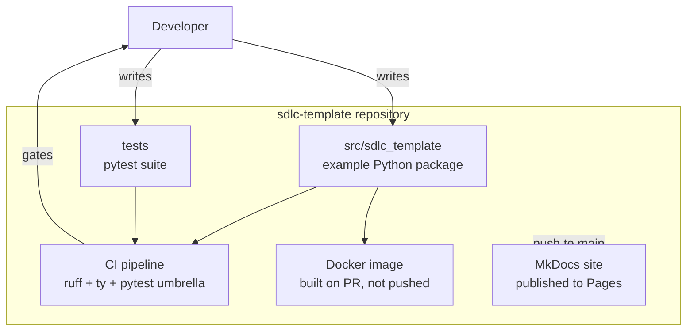

# C4 Level 2: Containers

The keystone map: zoom in one level to the major runtime/deliverable pieces and
how they talk. "Container" here means a separately deployable or runnable unit
(a service, a CLI, a database, a CI pipeline), not specifically a Docker
container.

The diagram describes *this template* as an example.

## What belongs here

- Each major container, its responsibility, and its key technology.
- The data/control flow between containers.
- The contracts at the seams (link to [interfaces](interfaces.md)).

## What does not belong here

- The internals of any one container (that is [Level 3](components.md), written
  lazily).
- Class-level detail (Level 4, never hand-maintained).
