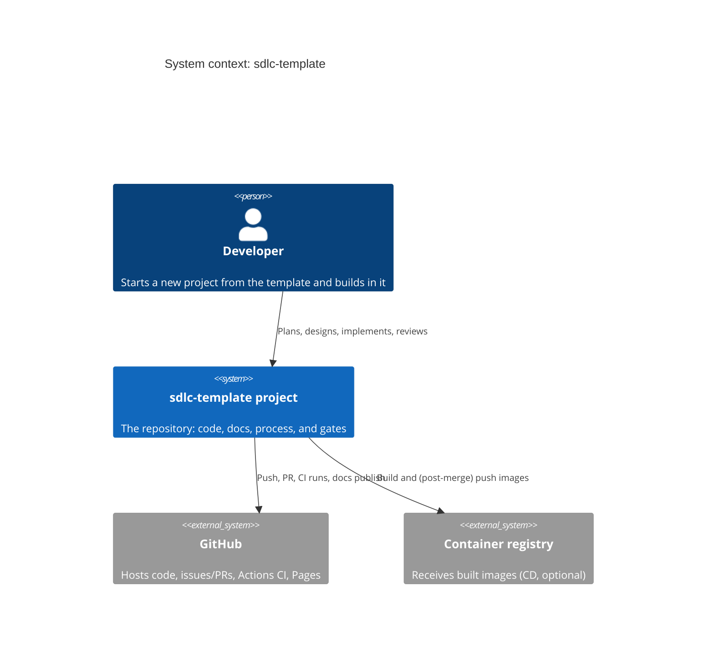

# C4 Level 1: System context

The highest-altitude view: the whole system as one box, who uses it, and what it
depends on. This is the only diagram everyone reads. Keep it to one page.

The diagram below describes *this template* as an example of how to write an L1.
Replace it with your own system when you use the template.

## What belongs here

- The single system boundary and its name.
- The people and external systems it interacts with.
- One sentence per relationship.

## What does not belong here

- Internal structure (that is [Level 2](containers.md)).
- Technology choices beyond what is needed to identify an external system.
